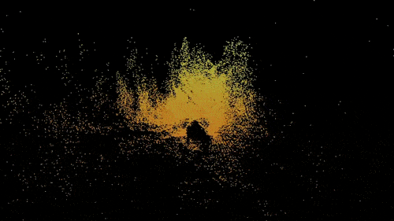

<h1 align="center">Hi 👋, I'm Didula Samaraweera</h1>

🔭 I’m currently an Undergrad of University of Moratuwa, Sri Lanka 👯 I’m looking to collaborate and compete 🤝 I’m looking for collaborations for Computer Vision related Project 🌱 I’m currently learning Generative AI & TinyML 💬 Don't hesitate to contact me  ⚡ Fun fact - I am lazy but smart

## 🌐 Socials:
   

# 💻 Tech Stack:
             
# 📊 GitHub Stats:

&nbsp;

## 🏆 GitHub Trophies

### ✍️ Random Dev Quote

### 🔝 Top Contributed Repo

---

<!-- Proudly created with GPRM ( https://gprm.itsvg.in ) -->
<!---->

###
